**Stable CI/CD pipeline** with **automated deployment, rollback capabilities, and version control**. 🚀

## 📚 Table of Contents

1. [Dev vs. Prod GitHub Profiles](#1-dev-vs-prod-github-profiles)
2. [GitFlow Branching](#2-gitflow-branching)
3. [`release/*` as CI/CD Trigger](#3-release-as-cicd-trigger)
4. [GitHub Actions: Dev Repos Only](#4-github-actions-dev-repos-only)
5. [Auto-Deploy on Validation](#5-auto-deploy-on-validation)
6. [Staged Rollout](#6-staged-rollout)
7. [Hotfix: Direct `main` Deploy](#7-hotfix-direct-main-deploy)
8. [Jira Integration: Branch Naming](#8-jira-integration-branch-naming)
9. [Tag-Based Rollback](#9-tag-based-rollback)
10. [Mermaid Diagram](#10-mermaid-diagram)
11. [Dev Onboarding: Git & GitFlow on macOS](#11-dev-onboarding-git--gitflow-on-macos)

---

## 1. Dev vs. Prod GitHub Profiles
*Separation between Dev and Prod GitHub profiles*

| **GitHub Profile**         | **Repositories**                                             | **Purpose**                                                                                              |
|----------------------------|--------------------------------------------------------------|----------------------------------------------------------------------------------------------------------|
| **TheMikestMike (Dev)**    | `WebQuiz-Devnet`, `Gesture-Control-System`, `File-Organizer`, `Webpage` | Active **development** using GitFlow. Code is tested and integrated here.                                |
| **TMMSoftware (Prod)**     | `WebQuiz-Devnet`, `Gesture-Control-System`, `File-Organizer`, `Webpage` | **Production-ready repositories.** Only tested, CI/CD-passed code lands here.                           |
| **GitHub Pages**           | `TMMSoftware/Webpage`                                          | Hosts [https://tmmsoftware.github.io/](https://tmmsoftware.github.io/) — reflects the latest deployed site. |

---

## 2. GitFlow Branching
*Branch naming and usage:*
- `hotfix/*`: for production bug fixes
- `main`: stable production source of truth
- `release/*`: used for staging + triggering CI/CD
- `feature/PRJ-1234-*`: feature branches tied to Jira tasks

---

## 3. `release/*` as CI/CD Trigger
Pre-prod gate: Only code merged into `release/*` in TheMikestMike and validated via CI/CD gets auto-deployed to the `main` branch of the matching TMMSoftware repo.

---

## 4. GitHub Actions: Dev Repos Only
GitHub Actions live only in Dev (`TheMikestMike`) repositories. No CI workflows are committed to TMMSoftware repos to ensure a clean production environment.

---

## 5. Auto-Deploy on Validation
Validation jobs (tests, linting, CI checks) run on every push to `release/*`. If successful, code is auto-deployed to the matching `TMMSoftware` production repository.

- 🧪 Run **validation jobs** (tests, linting, CI checks) on every push to `release/*`.
- ✅ If successful, **deploy code automatically** to the matching `main` branch in the `TMMSoftware` production repository.

---

## 6. Staged Rollout
*Planned Canary deployment help isolate risk and gradually release features.*

- Under Development

---

## 7. Hotfix: Direct `main` Deploy
- ✅ `hotfix/*` branches branch off `main`.
- ⚡ Hotfixes are tested and merged directly to `main`.

---

## 8. Jira Integration: Branch Naming
*Branch naming convention integrates with Jira for task tracking.*

| Branch Type | Format Example                        | CI/CD Behavior                              |
|-------------|---------------------------------------|---------------------------------------------|
| `feature/`  | `feature/PRJ-1234-add-signup-form`    | 🧪 Lint + unit test (optional)              |
| `release/`  | `release/1.0.0-alpha.1`               | ✅ Full test suite + auto-push to prod        |
| `hotfix/`   | `hotfix/INC-9876-fix-login`           | ✅ Test + deploy directly to prod           |
| `main`      | `main`                                | ✅ Final production truth; accepts merges from `release/*` |

---

## 9. Tag-Based Rollback
*Tag every production deployment and revert to a known-good tag in CI/CD. Optionally, use a GitHub Action for manual tag redeploy.*

1. **Tag every production deployment**  
   ```sh
   git tag v1.0.0-alpha.1 && git push origin --tags


## 10. Mermaid diagram

```mermaid
flowchart BT

  subgraph Developer_Workflow
    A1["🌱 feature/PRJ-1234-login-fix"] --> B1["🏷️ release/1.0.0-alpha.1"]
  end

  subgraph CI_CD_Pipeline
    B1 --> C1["🧪 Run Tests"]
    C1 -->|Pass| D1["🚀 Deploy to Prod GitHub Repo"]
    C1 -->|Fail| E1["⛔ Stop Deployment"]
  end

  subgraph Production
    D1 --> F1["🖥️ main production"]
    F1 --> G1["🏷️ Tag v1.0.0-alpha.1"]
  end

  subgraph Emergency_Patch
    H1["⚡ hotfix/INC-567-crash"] --> F1
    H1 --> B1
  end
```



## 11. Dev Onboarding: Git & GitFlow on macOS
*Install git and git-flow via Homebrew, clone your repository, and initialize Git Flow.*

```bash
brew install git
brew install git-flow
```

```bash
git clone https://github.com/TheMikestMike/your-repo.git
cd your-repo
git flow init
```
