**Stable CI/CD pipeline** with **automated deployment, rollback capabilities, and version control**. 🚀

## 📚 Table of Contents

1. [Separation between Dev and Prod GitHub profiles](#1-separation-between-dev-and-prod-github-profiles)
2. [GitFlow implementation using `feature/`, `release/`, `hotfix/`, `main`](#2-gitflow-implementation-using-feature-release-hotfix-main)
3. [Use of `release/*` as CI/CD deployment trigger (pre-prod gate ✅)](#3-use-of-release-as-cicd-deployment-trigger-pre-prod-gate-)
4. [GitHub Actions defined only in Dev repos](#4-github-actions-defined-only-in-dev-repos)
5. [Auto-deploy to TMMSoftware (Prod) on successful validation](#5-auto-deploy-to-tmmsoftware-prod-on-successful-validation)
6. [Staged rollout strategy](#6-staged-rollout-strategy)
7. [Hotfix strategy with direct deploy to `main`](#7-hotfix-strategy-with-direct-deploy-to-main)
8. [Jira integration via branch naming convention](#8-jira-integration-via-branch-naming-convention)
9. [Tag-based rollback workflow](#9-tag-based-rollback-workflow)
10. [Mermaid diagram](#10-mermaid-diagram)
11. [Dev onboarding (Git + GitFlow setup for macOS)](#11-dev-onboarding-git--gitflow-setup-for-macos)

---

## 1. Separation between Dev and Prod GitHub profiles

| **GitHub Profile**   | **Repositories** | **Purpose** |
|----------------------|------------------|-------------|
| **TheMikestMike (Dev)** | `WebQuiz-Devnet`, `Gesture-Control-System`, `File-Organizer`, `Webpage` | Active **development** using GitFlow. Code is tested and integrated here. |
| **TMMSoftware (Prod)** | `WebQuiz-Devnet`, `Gesture-Control-System`, `File-Organizer`, `Webpage` | **Production-ready repositories.** Only tested, CI/CD-passed code lands here. |
| **GitHub Pages** | `TMMSoftware/Webpage` | Hosts [https://tmmsoftware.github.io/](https://tmmsoftware.github.io/) — reflects the latest deployed site. |

## 2. GitFlow implementation using `feature/`, `release/`, `hotfix/`, `main`

Branch naming and usage:
- `feature/PRJ-1234-*`: feature branches tied to Jira tasks
- `release/*`: used for staging + triggering CI/CD
- `hotfix/*`: for production bug fixes
- `main`: stable production source of truth

## 3. Use of `release/*` as CI/CD deployment trigger (pre-prod gate ✅)

✅ Only **code merged into `release/*` in TheMikestMike** and validated via CI/CD gets auto-deployed to the `main` branch of the matching `TMMSoftware` repo.

## 4. GitHub Actions defined only in Dev repos

✅ GitHub Actions live only in Dev (`TheMikestMike`) repositories.
✅ No CI workflows are committed to `TMMSoftware` repos to ensure clean production.

## 5. Auto-deploy to TMMSoftware (Prod) on successful validation

- ✅ Run **validation jobs** (tests, linting, CI checks) on every push to `release/*`.
- ✅ If successful, **deploy code automatically** to the matching `main` branch in the `TMMSoftware` production repository.

## 6. Staged rollout strategy

- ✅ Planned Canary/staged deployment
- Future clusters and feature flags can help isolate risk and gradually release features

## 7. Hotfix strategy with direct deploy to `main`

- ✅ `hotfix/*` branches branch off `main`
- ✅ Hotfixes are tested and merged directly to `main` (and optionally `release/*`)

## 8. Jira integration via branch naming convention

| Branch Type | Format Example | CI/CD Behavior |
|-------------|----------------|----------------|
| `feature/`  | `feature/PRJ-1234-add-signup-form` | 🧪 Lint + unit test (optional) |
| `release/`  | `release/1.0.0-alpha.1`            | ✅ Full test suite + auto-push to prod |
| `hotfix/`   | `hotfix/INC-9876-fix-login`        | ✅ Test + deploy directly to prod |
| `main`      | `main`                             | ✅ Final production truth; accepts merges from `release/*` |

## 9. Tag-based rollback workflow

1. **Tag every production deployment**  
   ```sh
   git tag v1.0.0-alpha.1 && git push origin --tags
   ```
2. **Revert to a known-good tag in CI/CD**  
   ```sh
   git checkout v1.0.0-alpha.0
   git push origin main
   ```
3. Optional GitHub Action: manual tag redeploy

## 10. Mermaid diagram

```mermaid
flowchart BT

  subgraph Developer_Workflow
    A1["🌱 feature/PRJ-1234-login-fix"] --> B1["🏷️ release/1.0.0-alpha.1"]
  end

  subgraph CI_CD_Pipeline
    B1 --> C1["🧪 Run Tests"]
    C1 -->|Pass| D1["🚀 Deploy to Prod GitHub Repo"]
    C1 -->|Fail| E1["⛔ Stop Deployment"]
  end

  subgraph Production
    D1 --> F1["🖥️ main production"]
    F1 --> G1["🏷️ Tag v1.0.0-alpha.1"]
  end

  subgraph Emergency_Patch
    H1["⚡ hotfix/INC-567-crash"] --> F1
    H1 --> B1
  end
```



## 11. Dev onboarding (Git + GitFlow setup for macOS)

```bash
brew install git
brew install git-flow
```

```bash
git clone https://github.com/TheMikestMike/your-repo.git
cd your-repo
git flow init
```

✅ Last updated: 2025-03

